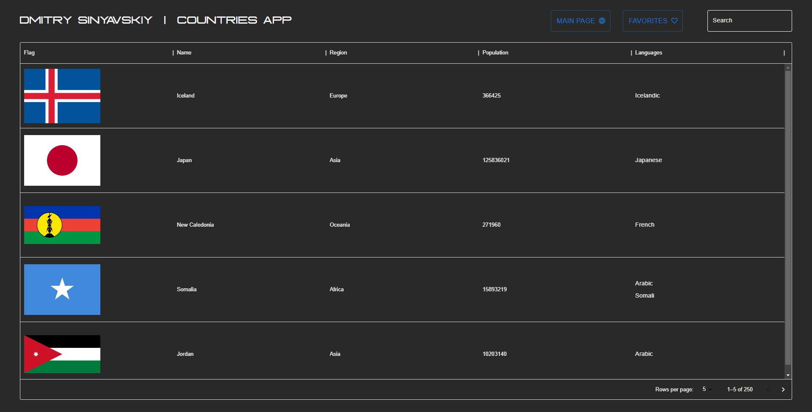

# Dmitry Sinyavskiy Country Application

## Built with

<!-- ICONS found at: ht<rtps://github.com/devicons/devicon/tree/master/icons -->
<div> 
      &nbsp;
      &nbsp;
      &nbsp;
</div>

- React application is written in Typescript
- The user interface is divided into pages that are routed through react-router-dom.
- Materialui is used for styling

## Installation

### NPM

1. You can run the application manually via `npm`

   Run this command in the terminal to be sure that you have an `npm` installed on your device

```sh
npm -v
```

2. Now you need to install `npm` packages for the project

```sh
npm install
```

3. When all is done you can run the application in development mode by running this command

```sh
npm run dev
```

4. Application will run on the ports:

   - http://localhost:5173

5. Or you can build the application and run it with the following command

```sh
npm run build
```

```sh
npm run preview
```

4. Application will run on the ports:

   - http://localhost:4173

## Functionalities and Usage

<!--  -->

- Select a country to see more information about it

<!--  -->

- Press the map button to open a new google maps tab with the country location

<!--  -->

- You can use the search field

<!--  -->

- By pressing on Logo you will be redirected to this GitHub repository

## Testing

- If you want to run the tests manually, in the root folder where the file `package.json` is located, run this command in a terminal

```sh
npm test
```

<!--  -->
