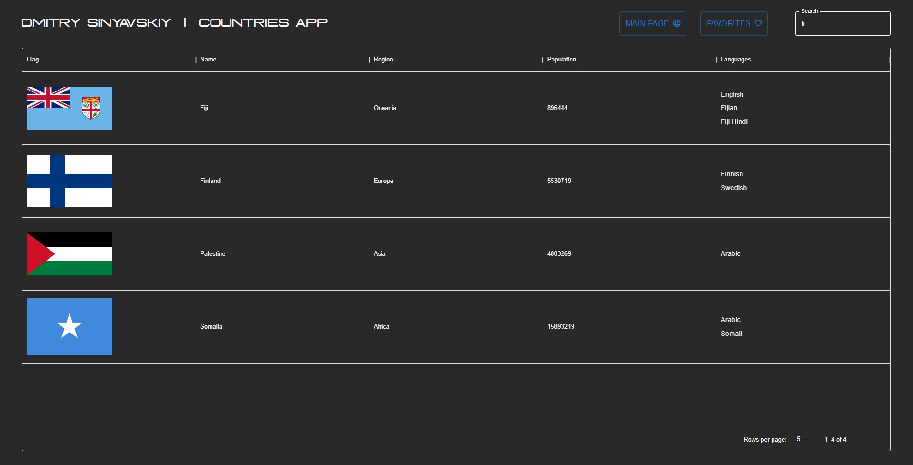
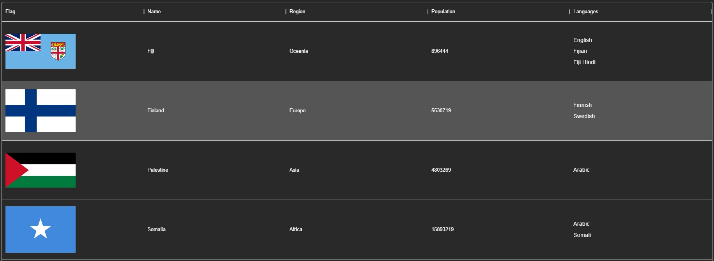
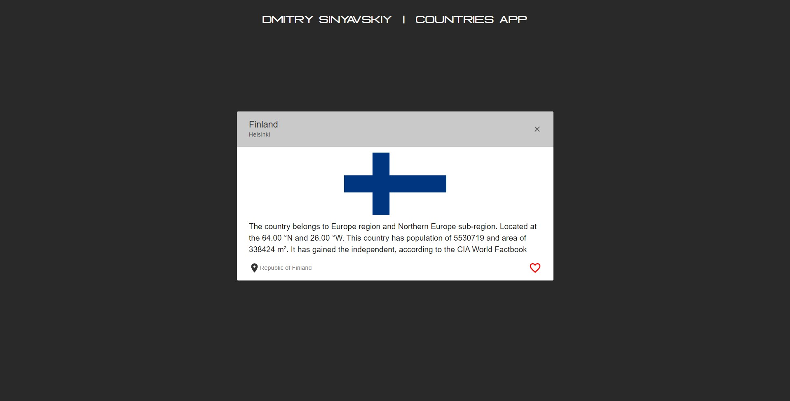
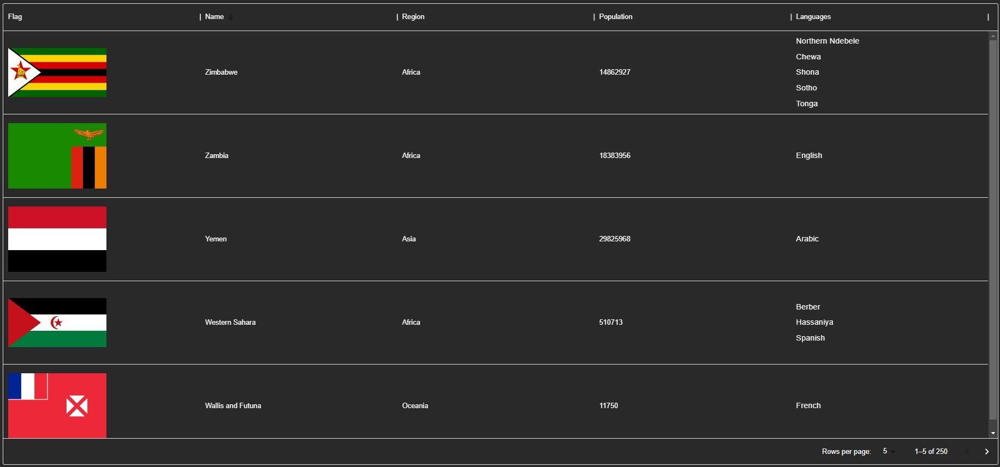
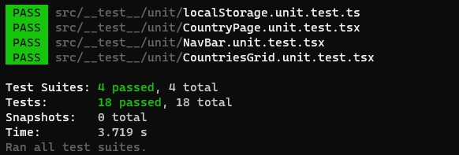

# Dmitry Sinyavskiy Country Application

## Built with

<!-- ICONS found at: ht<rtps://github.com/devicons/devicon/tree/master/icons -->
<div> 
      &nbsp;
      &nbsp;
      &nbsp;
      &nbsp;
</div>

- React application is written in Typescript
- The user interface is divided into pages that are routed through react-router-dom.
- Materialui is used for styling
- Tests are implemented with JavaScript language

## Installation

### NPM

1. You can run the application manually via `npm`

   Run this command in the terminal to be sure that you have an `npm` installed on your device

```sh
npm -v
```

2. Now you need to install `npm` packages for the project

```sh
npm install
```

3. When all is done you can run the application in development mode by running this command

```sh
npm run dev
```

4. Application will run on the ports:

   - http://localhost:5173

5. Or you can build the application and run it with the following command

```sh
npm run build
```

```sh
npm run preview
```

4. Application will run on the ports:

   - http://localhost:4173

## Functionalities and Usage


- You can use the search field to search by country name



- Select a country to see more information about it



- Press the map button to open a new google maps tab with the country location



- You can sort countries by name, region, and population


- The first press will activate sort by a-z, the second by z-a and the third will deactivate sorting



- By pressing on Logo you will be redirected to this GitHub repository

## Testing

- To run tests, in the root folder where the file `package.json` is located, run this command in a terminal

```sh
npm test
```


